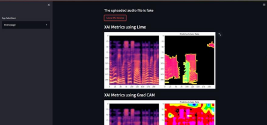

## TRUE Vox 🔊
Audio Deepfake Detection Tool
A Streamlit-based web application that detects whether an uploaded audio file is real or AI-generated (deepfake) using deep learning.

## 🧠 About the Project
With the rise of AI-generated voice cloning and synthetic speech, distinguishing real audio from deepfakes has become a critical challenge. 
TRUE Vox addresses this by analyzing audio signals and classifying them as real or fake using an LSTM-based deep learning model trained on 
audio features (MFCC).

## 🖥️ Demo
 
#Upload a .wav audio file → Click Predict → Get instant Real/Fake classification with model performance charts.

## ⚙️ Features
Upload and play WAV audio files directly in the browser
Real vs Fake audio classification using a trained deep learning model
Visual display of model accuracy and loss over training epochs
Clean, minimal UI built with Streamlit

## 🛠️ Tech Stack
Layer                 Tools
1.Language        -> Python
2.Web Framework   -> Streamlit
3.Deep Learning   -> LSTM (Keras / TensorFlow)
4.Audio Feature   -> ExtractionMFCC (Librosa)
5.Data Processing -> NumPy, Pandas
6.Visualization   -> Matplotlib

## Dataset
The dataset used in this project contains real and synthetic audio samples (~360MB).
Due to GitHub file size limitations, the dataset is not included in this repository.
You can:
- Request access to the dataset
- Or use publicly available deepfake audio datasets (e.g., ASVspoof)

## 📁 Project Structure
truevox/
│
├── test.py               # Main Streamlit app
├── model/                # Trained LSTM model files
├── logo.png              # App logo
├── requirements.txt      # Python dependencies
└── README.md

## 🚀 Getting Started
1. Clone the repository
git clone https://github.com/your-username/truevox.git
cd truevox

2. Install dependencies
pip install -r requirements.txt

3. Run the app
streamlit run test.py

## 📦 Requirements
streamlit
numpy
matplotlib
librosa
tensorflow
pandas

## 📊 How It Works
Audio Upload — User uploads a .wav file
Feature Extraction — MFCC (Mel-Frequency Cepstral Coefficients) are extracted from the audio signal
Model Prediction — Features are passed through a trained LSTM model
Result — Audio is classified as Real ✅ or Fake ⚠️
Visualization — Training accuracy and loss curves are displayed

## 👩‍💻 Author
Rutuja Vanyalkar
LinkedIn: https://www.linkedin.com/in/rutujavanyalkar29

## 📄 License
This project is for educational and research purposes.
